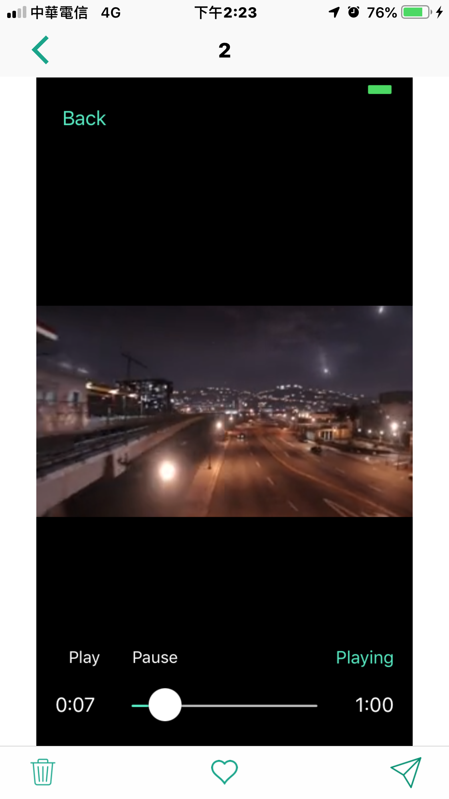
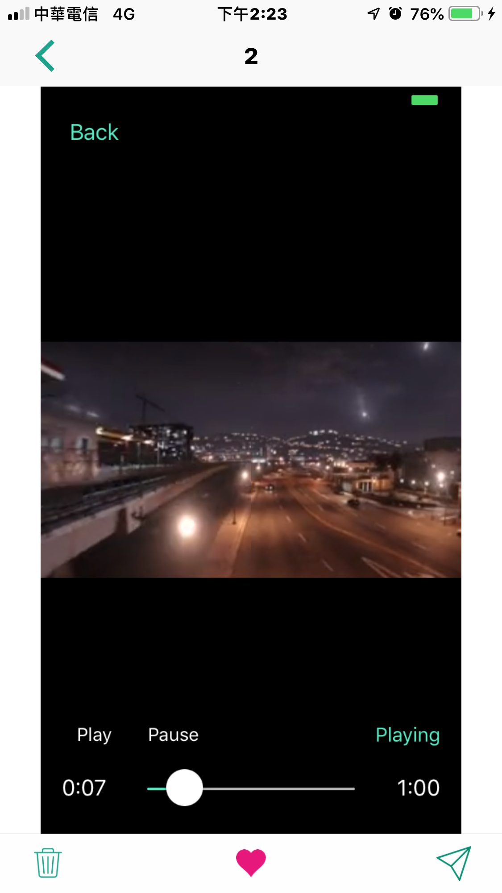
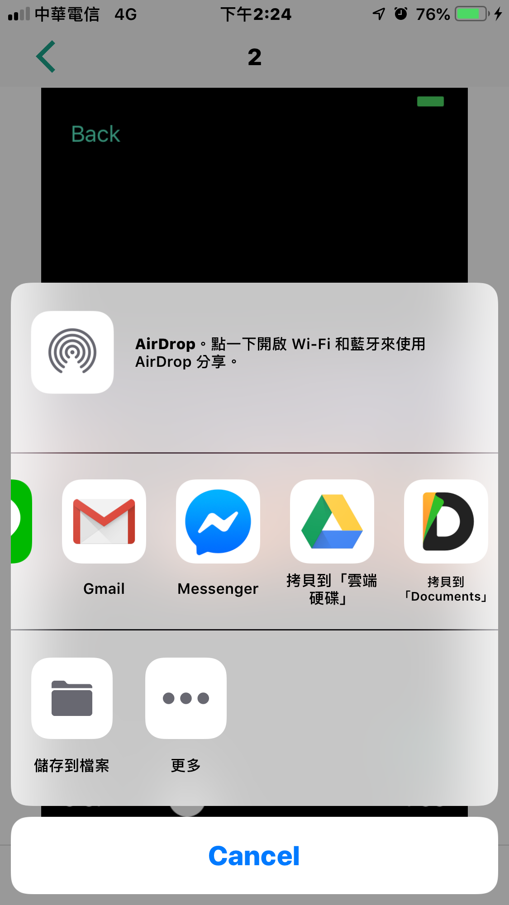
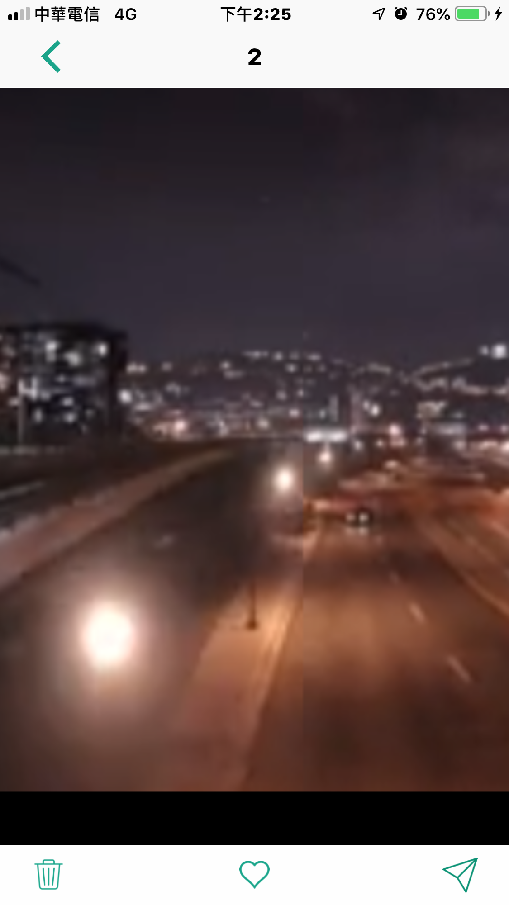

# IRGallery-swift 

- IRGallery-swift is a powerful gallery for iOS.

## Features
- Captions.
- Rotation support.
- Load images locally or from a web URL.
- Custom UITabBarItems.
- Default UITabBarItems:
    - Delete.
    - Favorite.
    - Share.
    
## Future
- Single tap fullscreen mode.
- Double tap image zooming.
- Pinch zooming.

## Install
### Git
- Git clone this project.
- Copy this project into your own project.
- Add the .xcodeproj into you  project and link it as embed framework.
#### Options
- You can remove the `demo` and `ScreenShots` folder.

### Cocoapods
- Add `pod 'IRGallery-swift'`  in the `Podfile`
- `pod install`

## Usage

### Basic
```swift
import IRGallery_swift

let galleryVC = IRGalleryViewController.init(photoSrc: self)
galleryVC.delegate = self
galleryVC.startingIndex = indexPath.row
galleryVC.useThumbnailView = false
galleryVC.gotoImageByIndex(UInt(indexPath.row), animated: false)
self.navigationController?.pushViewController(galleryVC, animated: true)
```

- Use `IRGalleryViewControllerSourceDelegate`.
```swift
// MARK: - IRGalleryViewControllerDelegate
func numberOfPhotosForPhotoGallery(gallery: IRGalleryViewController) -> Int {
    return images.count
}

func photoGallery(gallery: IRGalleryViewController, sourceTypeForPhotoAtIndex index: UInt) -> IRGalleryPhotoSourceType {
    return .local
}

func photoGallery(gallery: IRGalleryViewController, captionForPhotoAtIndex index: UInt) -> String? {
    let filename = "Photo \(index + 1)"
    return filename
}

func photoGallery(gallery: IRGalleryViewController, filePathForPhotoSize size: IRGalleryPhotoSize, index: UInt) -> String? {
    let path = Bundle.main.url(forResource: images[Int(index)] as! String?, withExtension: nil)?.path
    return path
}

func photoGallery(gallery: IRGalleryViewController, urlForPhotoSize size: IRGalleryPhotoSize, index: UInt) -> String? {
    return nil
}

func photoGallery(gallery: IRGalleryViewController, isFavoriteForPhotoAtIndex index: UInt) -> Bool {
    return false
}
```

### Advanced settings

- Use `IRGalleryViewControllerDelegate`.
```swift
func photoGallery(gallery: IRGalleryViewController, deleteAtIndex index:UInt)
func photoGallery(gallery: IRGalleryViewController, addFavorite isAddToFavortieList: Bool, index: UInt)
```

- Make your custome Bar Items.
```swift
var barItems: [UIBarButtonItem]

var deleteButton: UIBarButtonItem?
var favoriteButton: UIBarButtonItem?
var sendButton: UIBarButtonItem?

// create buttons for toolbar
let doDeleteButton = UIButton.init(frame: CGRect.init(x: 0, y: 0, width: 40, height: 50))
var image = UIImage.imageNamedForCurrentBundle(name: "btn_trash")
image = Utilities.image(image!, scaledToSize: CGSize.init(width: 20, height: 26.67))
doDeleteButton.setImage(image, for: .normal)
image = UIImage.imageNamedForCurrentBundle(name: "btn_trash")
image = Utilities.image(image!, scaledToSize: CGSize.init(width: 20, height: 26.67))
doDeleteButton.setImage(image, for: .highlighted)
doDeleteButton.addTarget(self, action: #selector(deleteClk), for: .touchUpInside)
self.deleteButton = UIBarButtonItem.init(customView: doDeleteButton)

let doFavoriteButton = UIButton.init(frame: CGRect.init(x: 0, y: 0, width: 40, height: 50))
image = UIImage.imageNamedForCurrentBundle(name: "btn_video_heart")
image = Utilities.image(image!, scaledToSize: CGSize.init(width: 21.4, height: 20))
doFavoriteButton.setImage(image, for: .normal)
image = UIImage.imageNamedForCurrentBundle(name: "btn_video_heart")
image = Utilities.image(image!, scaledToSize: CGSize.init(width: 21.4, height: 20))
doFavoriteButton.setImage(image, for: .highlighted)
image = UIImage.imageNamedForCurrentBundle(name: "btn_heart_h")
image = Utilities.image(image!, scaledToSize: CGSize.init(width: 21.4, height: 20))
doFavoriteButton.setImage(image, for: .selected)
doFavoriteButton.addTarget(self, action: #selector(addToMyFavoritesClk), for: .touchUpInside)
self.favoriteButton = UIBarButtonItem.init(customView: doFavoriteButton)

let doSendButton = UIButton.init(frame: CGRect.init(x: 0, y: 0, width: 40, height: 50))
image = UIImage.imageNamedForCurrentBundle(name: "btn_video_send")
image = Utilities.image(image!, scaledToSize: CGSize.init(width: 25, height: 25))
doSendButton.setImage(image, for: .normal)
image = UIImage.imageNamedForCurrentBundle(name: "btn_video_send")
image = Utilities.image(image!, scaledToSize: CGSize.init(width: 25, height: 25))
doSendButton.setImage(image, for: .highlighted)
doSendButton.addTarget(self, action: #selector(shareClk), for: .touchUpInside)
self.sendButton = UIBarButtonItem.init(customView: doSendButton)

barItems.insert(self.sendButton!, at: 0)
barItems.insert(self.favoriteButton!, at: 0)
barItems.insert(self.deleteButton!, at: 0)

...

let galleryVC = IRGalleryViewController.init(photoSrc: self, barItems: barItems)
```

## Screenshots
| List | Gallery |
|:---:|:---:|
|  |  |
| Delete | Favorite |
|  |  |
| Share | Scale |
|  |  |

| Landscape |
|:---:|
|  |

